# Hi there, I'm Daniel Páez 👋

### **Software Engineer · Full Stack Developer · AI & Automation**

I design and build software products, web applications, desktop tools, and automated solutions focused on solving real-world problems.

---

## 👨‍💻 About Me

I'm a **Systems and Computing Engineer** who enjoys turning ideas and business requirements into reliable software.

My work spans the development process — from understanding requirements and designing solutions to implementing, integrating, deploying, and maintaining applications in real environments.

I currently focus on:

* 🌐 **Full Stack Web Development**
* 🖥️ **Desktop Applications**
* 🤖 **Artificial Intelligence & AI-powered solutions**
* ⚙️ **Automation & Process Optimization**
* 🔌 **API Design & System Integrations**
* 📊 **Data-driven Applications**

I particularly enjoy projects where **software engineering, automation, and real business needs intersect**.

---

## 🚀 Featured Projects

### ⚖️ ASOBANCARIA — Judicial & Legislative Management Platform

**Private project · La Manuelina S.A.S. · 2026**

Web platform developed for the management and consultation of legal processes and legislative information.

The platform integrates authentication, structured data management, judicial process workflows, legislative project management, document handling, and production infrastructure.

**Built with:**

`Next.js` · `TypeScript` · `React` · `Tailwind CSS` · `Prisma` · `MySQL` · `NextAuth.js` · `Microsoft Entra ID` · `Railway`

**Highlights:**

* 🔐 Federated authentication with Microsoft Entra ID
* ⚖️ Judicial process management for multiple Colombian institutions
* 🏛️ Legislative project management for Senate and House of Representatives
* 📄 Document and procedural information management
* 🔎 Advanced filtering, pagination, and search
* 📊 Excel-based data ingestion and normalization
* 📑 PDF and data export functionality
* 🗄️ Prisma-based data layer with MySQL in production
* 🚀 Production deployment on Railway
* 🏗️ Local development architecture using SQLite without Docker

> 🔒 Private and confidential project developed for **La Manuelina S.A.S.**

---

### 🔎 SAMAI Consulta — Judicial Process Search Platform

**Private project · La Manuelina S.A.S. · 2026**

Web platform designed to simplify the consultation of judicial processes through the **SAMAI** system, providing search, document access, PDF visualization, and persistent caching.

The application was designed with resilience in mind, allowing previously consulted information to remain accessible when the external service becomes unavailable.

**Built with:**

`Node.js` · `Express` · `Playwright` · `Chromium` · `MySQL` · `JavaScript` · `CSS`

**Highlights:**

* 🔎 Search by case number or procedural party
* 📁 Complete case and document visualization
* 📄 Integrated PDF viewer
* 💾 Multi-level caching strategy
* 📴 Offline access to previously consulted information
* 🗄️ Persistent cache using MySQL in production
* 🌐 External service availability monitoring
* 🔄 Automatic retries and error classification
* 📥 Document downloads preserving original filenames
* 🎨 Custom frontend built with CSS

> 🔒 Private and confidential project developed for **La Manuelina S.A.S.**

---

### ✈️ M&D Cotizaciones

**Desktop application for M&D Travels Colombia**

A desktop tool designed to streamline the travel quotation workflow by bringing information gathering, AI assistance, document generation, and quotation management into a single application.

**Built with:**

`Electron` · `JavaScript` · `ExcelJS` · `LaTeX` · `OpenRouter AI` · `GitHub Releases`

**Highlights:**

* 🤖 AI-assisted travel quotation and content generation
* 🌐 Embedded browser for travel platforms
* 📊 Automated Excel quotation generation
* 📄 Automated PDF generation with LaTeX
* 🔄 Automatic application updates through GitHub Releases
* 🖥️ Standalone desktop application

> 🔒 Private repository — developed for a commercial project.

---

### 🌍 M&D Travels

🔗 **https://mydtravels.vercel.app/**

Full Stack web platform developed for **M&D Travels Colombia**, combining a corporate website with interactive functionality and AI-powered features.

**Highlights:**

* 🌐 Full Stack architecture
* 🤖 AI-powered travel assistant
* 📱 Responsive and modern UI
* 📩 Automated contact workflows
* 🛡️ Google reCAPTCHA integration
* ✉️ Resend email integration
* 🚀 Production deployment with Vercel
* 📲 PWA-ready architecture

---

### 🍰 Pastelería Deleitarte

🔗 **https://pasteleriadeleitarte.com/**

Corporate website developed from scratch according to the client's requirements.

**Highlights:**

* 🎨 Responsive UI
* ⚙️ Full Stack development
* 🔧 Custom functionality
* 🌐 Production deployment
* 🔄 Git & GitHub workflow
* 🚀 Continuous deployment with Vercel

---

### ⚡ JR Mantenimiento Eléctrico

🔗 **https://jrmantenimientoelectrico.com/**

Corporate website developed for an electrical services company, including the technical configuration required to deploy and maintain the site in production.

**Highlights:**

* 🌐 Full website development
* 🔗 Domain configuration
* 🔎 Google Search Console integration
* 🗺️ Sitemap generation
* 📈 Technical SEO
* 🚀 Production deployment

---

### 🛍️ Dupe Perfumes

🔗 **https://dupe-perfumes.vercel.app/**

E-commerce platform currently under development.

The project focuses on building a customized commerce experience around specific business requirements.

**Highlights:**

* 🛒 E-commerce architecture
* ⚙️ Custom business logic
* 🌐 Full Stack development
* 🔧 Client-oriented development workflow
* 🔀 Git-based collaboration
* 🚀 Vercel deployment

---

## 💼 Professional Experience

### 🏢 Full Stack Developer — La Manuelina S.A.S.

**September 2026 — Present**

Developing software solutions for real-world business and institutional requirements, including web platforms, data management systems, integrations, automation, and production deployments.

Current work includes:

* 🌐 Full Stack application development
* 🏗️ Software architecture and technical design
* 🔐 Authentication and identity integrations
* 🗄️ Database design and data management
* 🔌 API integrations
* 📊 Data ingestion and normalization
* 🚀 Cloud deployment and production infrastructure
* ⚙️ Internal tools and process optimization

Current projects include private platforms for **judicial process management, legislative information, and judicial information consultation**.

---

### 💻 Full Stack Developer — AXXIOMA

Developing web applications, APIs, integrations, automation workflows, and software solutions for business processes.

---

### ✈️ Software Engineer & Co-Founder — M&D Travels Colombia

Building the company's digital infrastructure, including web platforms, internal software, automation, and AI-assisted tools.

---

### 🎮 Unity Programming Instructor — Kodland

Teaching programming and game development concepts using **C# and Unity**, helping students build interactive projects while strengthening their programming fundamentals.

---

## 🔒 Commercial & Confidential Work

Some of my work is developed for clients, companies, or private initiatives and therefore cannot be published publicly.

Even when the source code is private, I can discuss the engineering behind these projects, including:

* Software architecture
* Technical decisions
* API integrations
* Database design
* Authentication
* Automation strategies
* Deployment infrastructure
* Development workflows
* Challenges and solutions
* Performance and maintainability

---

## 🛠️ Tech Stack

### Languages

### Frontend

### Backend & APIs

### Desktop

### Databases

### AI & Automation

### DevOps & Deployment

### Other Technologies

---

## 🧠 Engineering Interests

I'm particularly interested in building systems that combine:

* **Software Engineering**
* **Artificial Intelligence**
* **Automation**
* **Cloud & Web Technologies**
* **Developer Tools**
* **Data & APIs**
* **Interactive Applications**

I enjoy learning new technologies by **building actual products and solving concrete problems**.

---

## 🌱 Currently Exploring

* 🏗️ Software Architecture & Design Patterns
* 🤖 Artificial Intelligence & LLM applications
* ☁️ Cloud infrastructure and deployment
* ⚙️ Scalable backend systems
* 🔄 Advanced workflow automation
* 🧩 System integrations and developer tooling

---
# 📈 GitHub Statistics

  

  

---

# 🔥 GitHub Streak

  

---

## 🤝 Let's Connect

I'm always interested in **building useful software, collaborating on interesting projects, and exploring new ideas in technology**.

📧 **Email:** [danielpaezzamudio0@hotmail.com](mailto:danielpaezzamudio0@hotmail.com)

💻 **GitHub:** [github.com/NoxiousCape](https://github.com/NoxiousCape)

🌍 **M&D Travels:** [mydtravels.vercel.app](https://mydtravels.vercel.app/)

---

### *Building software that turns ideas into useful products.*

