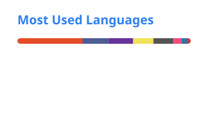

# Hi there, I'm Daniel Páez 👋

### **Software Engineer · Full Stack Developer · AI & Automation**

I build software that turns **complex business processes into practical, reliable tools**.

From full-stack web platforms and data-intensive systems to desktop applications, automation and AI-powered solutions, I enjoy working on software that solves **real problems in real environments**.

  
  
  

---

## 👨‍💻 About Me

I'm a **Systems and Computing Engineer** focused on building software products, internal tools and automated solutions.

My work covers the complete development process — from understanding a business requirement and designing the solution to implementation, integration, deployment and maintenance in production environments.

I currently work across:

* 🌐 **Full Stack Web Development**
* 🖥️ **Desktop Applications**
* 🤖 **Artificial Intelligence & LLM-powered solutions**
* ⚙️ **Automation & Process Optimization**
* 🔌 **API Design & System Integrations**
* 📊 **Data Processing & Data-driven Applications**
* ☁️ **Cloud Deployment & Production Infrastructure**

I particularly enjoy projects where **software engineering meets real operational problems** — especially when a repetitive, complex or manual process can be transformed into a reliable piece of software.

---

# 🚀 Selected Work

A growing part of my portfolio comes from **professional and commercial projects**.

Some of these projects are private or confidential, but I can still showcase the engineering challenges, architecture and technologies involved.

---

## ⚖️ Central de Consultas La Manuelina

**Private project · La Manuelina S.A.S. · 2026**

A web platform designed to centralize the consultation of **judicial processes in Colombia**, integrating both the **SAMAI** system and the **Rama Judicial — Consulta Nacional Unificada**.

The project evolved from a dedicated SAMAI consultation tool into a broader consultation platform with individual searches, bulk processing, persistent caching, document access and offline resilience.

### Built with

`Node.js` · `Express` · `JavaScript` · `Playwright` · `Chromium` · `MySQL` · `ExcelJS` · `xlsx-stream-reader` · `SSE` · `CSS`

### Highlights

* 🔎 Search by **23-digit case number** with automatic corporation identification
* 👤 National search by procedural party across **76 judicial corporations**
* 🔄 Cross-jurisdiction bridge between **SAMAI and Rama Judicial**
* 📁 Complete case and document consultation
* 📄 Integrated PDF visualization and document downloads
* 💾 Multi-level persistent caching
* 📴 Offline access to previously consulted information
* 📊 Bulk Excel processing with live progress, ETA and resumable checkpoints
* 🔁 Automatic retry and error classification
* 🧵 Server-Sent Events for real-time job progress
* 🗄️ MySQL persistence in production
* 📥 Bulk results exported to Excel and other formats
* 🧭 Geographic search expansion for large-scale Rama Judicial queries
* 🔐 Production-oriented architecture designed around external service availability

> 🔒 Private and confidential project developed for **La Manuelina S.A.S.**

---

## ⚖️ ASOBANCARIA — Judicial & Legislative Management Platform

**Private project · La Manuelina S.A.S. · 2026**

Web platform developed for the management and consultation of **judicial processes and legislative information** for an institutional environment.

The platform combines authentication, structured data management, judicial workflows, legislative project management, document handling and production infrastructure.

### Built with

`Next.js` · `TypeScript` · `React` · `Tailwind CSS` · `Prisma` · `MySQL` · `NextAuth.js` · `Microsoft Entra ID` · `Railway`

### Highlights

* 🔐 Federated authentication with **Microsoft Entra ID**
* ⚖️ Judicial process management
* 🏛️ Legislative project management for Senate and House of Representatives
* 📄 Procedural and document information management
* 🔎 Advanced filtering, pagination and search
* 📊 Excel-based data ingestion and normalization
* ✏️ CRUD workflows with logical deletion
* 🗄️ Prisma-based data layer
* 🚀 Production deployment on Railway
* 🏗️ SQLite-based local development environment
* 📱 Responsive institutional interface

> 🔒 Private and confidential project developed for **La Manuelina S.A.S.**

---

## 📄 PDEx — Excel → PDF

**Private project · 2026**

A local desktop tool that transforms **dense Excel spreadsheets into structured, readable and print-ready PDFs**.

Instead of treating an Excel file as a page to be printed directly, PDEx analyzes its structure and dynamically generates a document layout designed around readability and information preservation.

### Built with

`Python` · `Tkinter` · `ReportLab` · `OpenPyXL` · `PyInstaller`

### Highlights

* 📊 Processes spreadsheets with hundreds of records
* 🧠 Intelligent column and row analysis
* 📐 Dynamic layout and column sizing
* 📄 Generates structured PDFs from complex spreadsheets
* 🧩 Fragmentation of very large rows across multiple pages
* 🔢 Preserves complete source information without summarizing or truncating
* 📝 Optional PDF covers and metadata
* 📚 Individual-sheet or unified multi-sheet output
* 🖥️ Distributed as a standalone `.exe`
* ⚙️ Supports both graphical and CLI workflows
* ✅ Automated validation of generated documents
* 📦 Versioned corporate distribution through GitHub Releases

The tool is designed to operate **100% locally**, making it suitable for workflows involving sensitive information.

> 🔒 Private project developed for professional/corporate use.

---

## ✈️ M&D Cotizaciones

**Desktop application · M&D Travels Colombia**

A desktop application designed to streamline the travel quotation workflow by combining information gathering, AI assistance, quotation management and document generation.

### Built with

`Electron` · `JavaScript` · `ExcelJS` · `LaTeX` · `OpenRouter AI` · `GitHub Releases`

### Highlights

* 🤖 AI-assisted quotation and content generation
* 🌐 Embedded browser for travel platforms
* 📊 Automated Excel quotation generation
* 📄 Automated PDF generation with LaTeX
* 🔄 Automatic application updates
* 🖥️ Standalone desktop application

---

## 🌍 M&D Travels

🔗 https://mydtravels.vercel.app/

Full Stack web platform developed for **M&D Travels Colombia**, combining a corporate website with interactive functionality and AI-powered features.

### Highlights

* 🌐 Full Stack architecture
* 🤖 AI-powered travel assistant
* 📱 Responsive interface
* 📩 Automated contact workflows
* 🛡️ Google reCAPTCHA integration
* ✉️ Resend email integration
* 🚀 Production deployment with Vercel
* 📲 PWA-ready architecture

---

## 🍰 Pastelería Deleitarte

🔗 https://pasteleriadeleitarte.com/

Corporate website developed from scratch according to the client's requirements.

### Highlights

* 🎨 Responsive UI
* ⚙️ Full Stack development
* 🔧 Custom functionality
* 🌐 Production deployment
* 🔄 Git & GitHub workflow
* 🚀 Continuous deployment with Vercel

---

## ⚡ JR Mantenimiento Eléctrico

🔗 https://jrmantenimientoelectrico.com/

Corporate website developed for an electrical services company, including the technical configuration required for production deployment and maintenance.

### Highlights

* 🌐 Full website development
* 🔗 Domain configuration
* 🔎 Google Search Console integration
* 🗺️ Sitemap generation
* 📈 Technical SEO
* 🚀 Production deployment

---

## 🛍️ Dupe Perfumes

🔗 https://dupe-perfumes.vercel.app/

E-commerce platform developed around specific business requirements and a customized commerce workflow.

### Highlights

* 🛒 E-commerce architecture
* ⚙️ Custom business logic
* 🌐 Full Stack development
* 🔧 Client-oriented development workflow
* 🔀 Git-based collaboration
* 🚀 Vercel deployment

---

# 💼 Professional Experience

## 🏢 Full Stack Developer — La Manuelina S.A.S.

**September 2026 — Present**

Developing software solutions for real-world business and institutional requirements.

My current work includes:

* 🌐 Full Stack application development
* 🏗️ Software architecture and technical design
* 🔐 Authentication and identity integrations
* 🗄️ Database design and data management
* 🔌 API integrations
* 📊 Data ingestion and processing
* ⚙️ Automation and internal tools
* 🚀 Cloud deployment and production infrastructure
* 🧩 Integration with external and institutional systems

Current projects include platforms and tools related to **judicial information, legislative processes, data processing and business process automation**.

---

## ✈️ Software Engineer & Co-Founder — M&D Travels Colombia

Building the company's digital infrastructure, including web platforms, internal software, automation and AI-assisted tools.

---

## 🎮 Unity Programming Instructor — Kodland

Teaching programming and game development concepts using **C# and Unity**, helping students build interactive projects while strengthening their programming fundamentals.

---

# 🔒 Commercial & Confidential Work

Not all of my work can be published publicly.

Several of the systems I develop are intended for **companies, internal operations and institutional environments**, where the source code, data and infrastructure cannot be made public.

Even when a repository is private, I can discuss the engineering behind the project, including:

* Software architecture
* API integrations
* Database design
* Authentication and identity management
* Data processing
* Automation strategies
* External system integration
* Caching and resilience
* Deployment infrastructure
* Development workflows
* Performance considerations
* Technical challenges and solutions

This has become an important part of my development experience: **building software that has to work beyond a development environment.**

---

# 🛠️ Tech Stack

### Languages

### Frontend

### Backend & APIs

### Desktop

### Databases

### AI & Automation

### Data & Automation Tools

### DevOps & Deployment

### Other Technologies

---

# 🧠 Engineering Interests

I'm particularly interested in systems that combine:

* **Software Engineering**
* **Artificial Intelligence**
* **Automation**
* **Cloud & Web Technologies**
* **Data Processing**
* **APIs & System Integrations**
* **Developer Tools**
* **Desktop Applications**
* **Distributed & Resilient Systems**

I enjoy learning new technologies by **building actual products and solving concrete problems**.

---

# 🌱 Currently Exploring

* 🏗️ Software Architecture & Design Patterns
* 🤖 Artificial Intelligence & LLM applications
* ☁️ Cloud infrastructure and production deployment
* ⚙️ Advanced workflow automation
* 🔄 External system integrations
* 📊 Large-scale data processing
* 🧩 Developer tooling
* 🖥️ Cross-platform desktop applications

---

# 📈 GitHub Statistics

  

---

# 🔥 GitHub Streak

  

---

# 🤝 Let's Connect

I'm always interested in **building useful software, solving interesting technical problems, collaborating on projects and exploring new ideas in technology**.

📧 **Email:** [danielpaezzamudio0@hotmail.com](mailto:danielpaezzamudio0@hotmail.com)

💻 **GitHub:** [github.com/NoxiousCape](https://github.com/NoxiousCape)

🌍 **M&D Travels:** [mydtravels.vercel.app](https://mydtravels.vercel.app/)

---

### *Building software that turns complex problems into useful products.*

